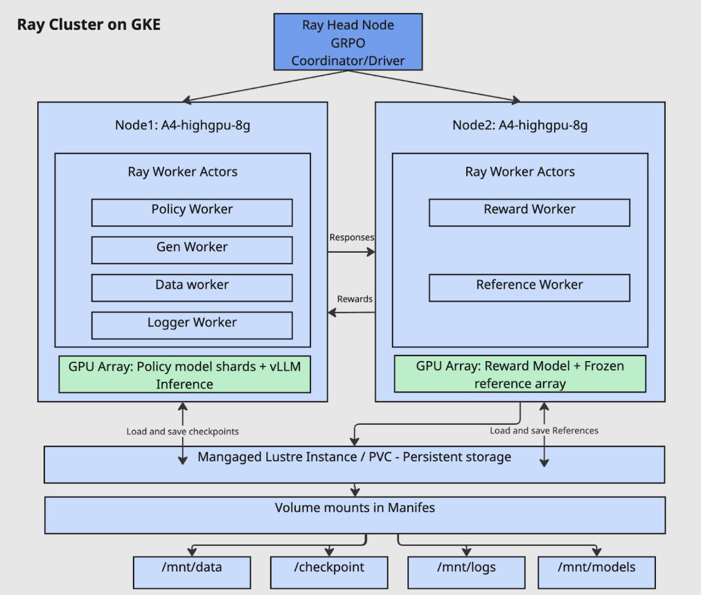
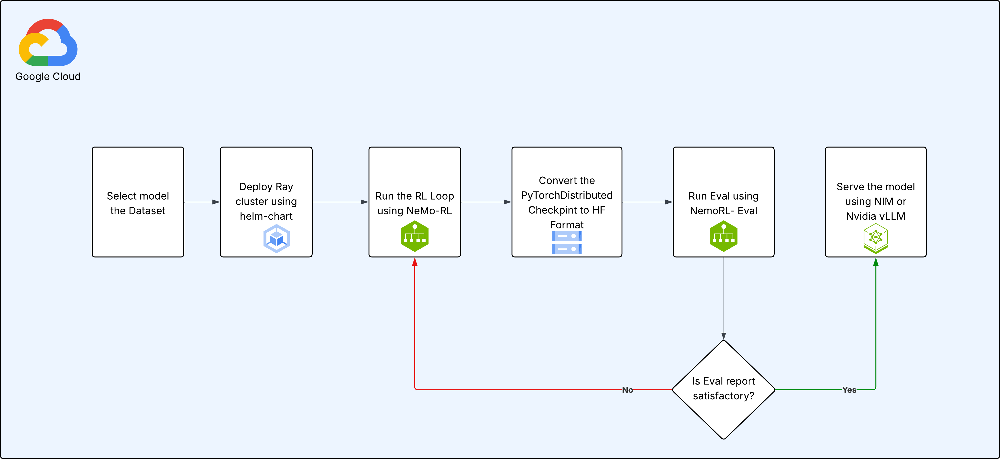

# Fine-Tuning Large Language Models with NeMo-RL and GRPO on Google Kubernetes Engine (GKE)

## 1. Overview

This recipe provides a comprehensive guide and toolkit for fine-tuning state-of-the-art large language models (LLMs) using Reinforcement Learning (RL). The solution leverages NVIDIA's NeMo-RL framework, running on a distributed Ray cluster deployed on Google Kubernetes Engine (GKE).

The primary goal is to enhance model performance on specific tasks by applying the **GRPO (Generative Rejection Policy Optimization)** algorithm. This process has been tested with several leading models, including:

*   **[Llama 3.1 (8B-it)](llama3.1-8b/README.md)**
*   **[Gemma 3 (1B-it)](gemma3-1b-it/gemma3-1b-single-node-g4.md)**
*   **[Gemma 3 (27B-it)](gemma3-27b-it/README.md)**
*   **[Qwen 2.5 (1.5B-it)](qwen2-1.5b/README.md)**

This example is validated on datasets **OpenMathInstruct**, **Deepscaler**, and **GSM8K**.

The architecture is designed for scalability and efficiency, utilizing a high-performance parallel filesystem and dedicated GPU resources for different components of the RL pipeline.

## 2. Architecture

The training infrastructure is built on a Ray cluster deployed on GKE, featuring a head node and multiple worker nodes. This setup allows for both collocated and non-collocated worker configurations. The diagram below illustrates a non-collocated setup where different workers run on separate nodes to optimize resource utilization.

#### Key Components:

*   **Ray Head Node:**
    *   Acts as the central coordinator for the Ray cluster.
    *   Runs the main driver process, which orchestrates the GRPO algorithm.

*   **Ray Worker Nodes (e.g., `A4-highgpu-8g`):**
    *   **Node 1 (Policy & Generation):**
        *   **Policy Worker:** Updates the model's policy based on feedback.
        *   **Gen Worker:** Generates responses using the current policy.
        *   **Data Worker:** Manages the data flow for training.
        *   **Logger Worker:** Handles logging and metrics.
        *   **GPU Array:** Utilizes vLLM for high-throughput inference with the sharded policy model.
    *   **Node 2 (Reward & Reference):**
        *   **Reward Worker:** Evaluates the generated responses and calculates a reward score.
        *   **Reference Worker:** Holds the frozen reference model to provide a baseline for comparison.
        *   **GPU Array:** Dedicated to running the reward and reference models.

*   **Persistent Storage:**
    *   A **Managed Lustre instance** (or other high-performance Persistent Volume Claim) is used for shared storage across all nodes.
    *   This ensures that models, checkpoints, data, and logs are persisted and accessible throughout the training lifecycle via volume mounts (`/mnt/data`, `/mnt/checkpoints`, `/mnt/logs`, `/mnt/models`).

## 3. Workflow Pipeline

The end-to-end process for fine-tuning and deploying a model follows a structured pipeline, ensuring reproducibility and iterative improvement.

#### Step-by-Step Process:

1.  **Select Model and Dataset:** Begin by choosing the base pre-trained model (Llama, Gemma, or Qwen) and the dataset you want to use for fine-tuning.

2.  **Deploy Ray Cluster:** Use the provided Helm chart to deploy a Ray cluster onto your GKE environment. This automates the setup of the head and worker nodes.

3.  **Run RL Training Loop:** Execute the main training script, which uses NeMo-RL to start the GRPO training loop. During this phase:
    *   The policy model generates responses.
    *   The reward model evaluates these responses.
    *   The GRPO algorithm updates the policy model's weights based on the rewards.
    *   Checkpoints are periodically saved to persistent storage.

4.  **Convert Checkpoint to Hugging Face Format:** After training, the `PyTorchDistributed` checkpoints generated by NeMo are converted into the standard Hugging Face (HF) format for broader compatibility.

5.  **Evaluate the Model:** Run the evaluation script (`NemoRL-Eval`) to measure the performance of the fine-tuned model against a set of metrics.

6.  **Review and Iterate:** Analyze the evaluation report.
    *   If the performance is not satisfactory, you can resume training from a saved checkpoint by returning to **Step 3**.
    *   If the model meets the desired performance criteria, proceed to deployment.

7.  **Serve the Model:** Deploy the final, fine-tuned model for inference. This can be achieved using high-performance serving solutions like **NVIDIA NIM** or **vLLM**.

## 4. How to Use This Folder

This folder ([nemoRL](./)) is structured to support multiple models. Each model has its own dedicated folder containing specific configurations and `README.md` files.

#### General Setup:

1.  **Prerequisites:**
    *   A Google Cloud project with billing enabled.
    *   `gcloud` CLI, `kubectl`, and `helm` installed and configured.
    *   Optional for kubectl - `krew` for installing `kubectl` plugins, including the `ray` plugin.
    *   Ray enabled on your GKE cluster.
    *   Access to a GKE cluster with GPU node pools (e.g., NVIDIA H100s, B200s, etc.).
    *   Huggingface access to models and datasets.
    *   Nvidia NGC API-Key for NGC Containers

2.  **Deploy Infrastructure:**
    *   Customize the `values.yaml` file to configure your Ray cluster (e.g., node types, autoscaling).
    *   Deploy the cluster using the Helm chart, instructions are in model readme files.

3.  **Run Training:**
    *   Navigate to the folder corresponding to the model you wish to train (e.g., `gemma3-27b-it/`).
    *   Follow the instructions in the model-specific `README.md` to prepare your data and launch the training script.
